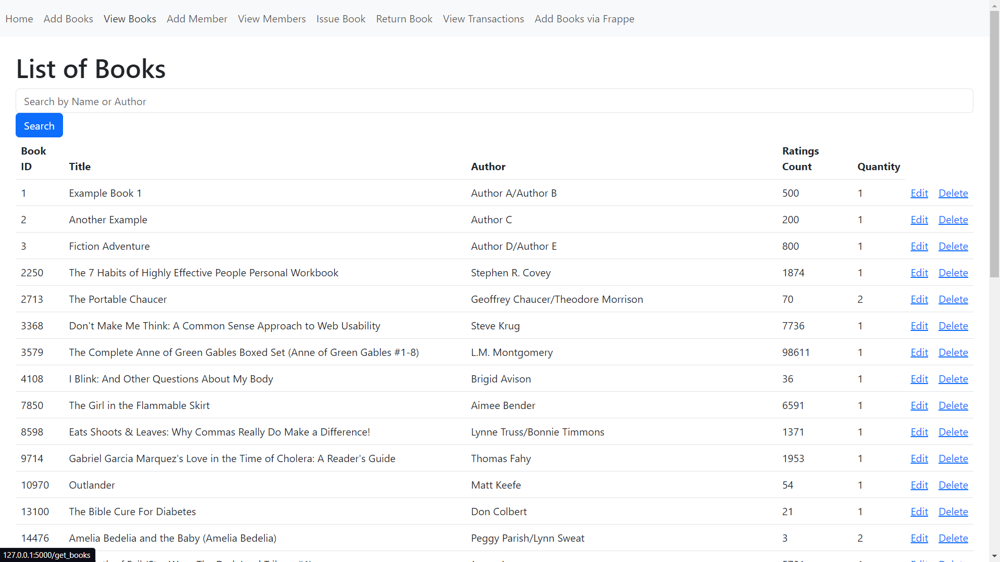
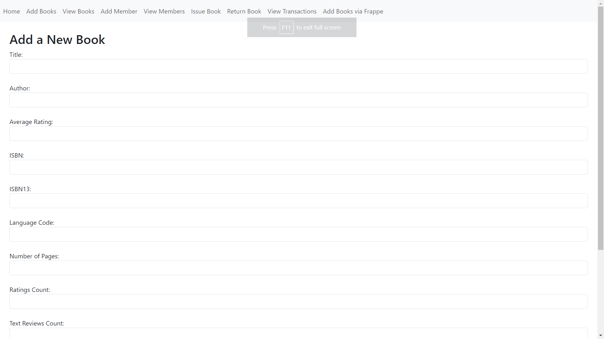
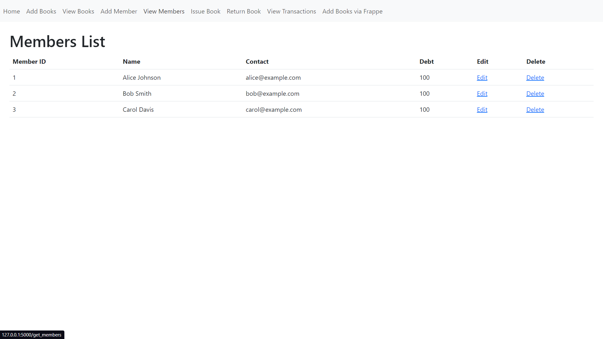
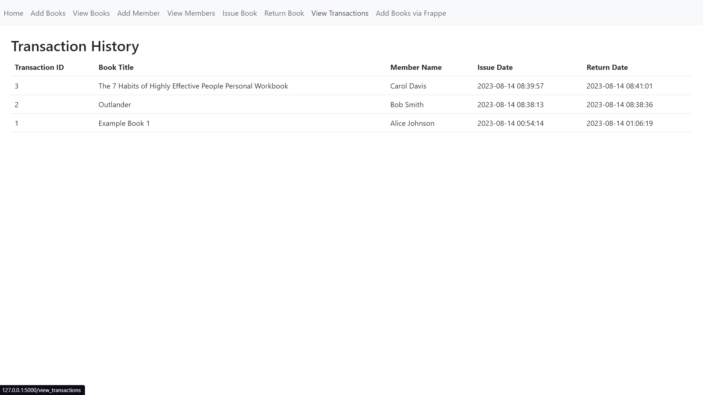

# Flask-SQLite Library Management System

Welcome to the Flask-SQLite Library Management System! This application offers a straightforward way to manage your library's book collection and member records. Built using Flask and backed by a SQLite database, this system enables you to perform various operations such as adding, editing, deleting, issuing, and returning books, as well as managing members and reviewing transactions.

## Prerequisites

Before you get started, ensure you have the following prerequisites in place:

- Python 3.x
- Flask
- SQLite
- requests

## Installation and Setup

1. **Clone the Repository:**

   ```bash
   git clone https://github.com/your-username/library-app.git
   cd library-app
   ```

2. **Create and Initialize the Database:**

   To set up the database with initial data, run the following command:

   ```bash
   python createdb.py
   ```

3. **Install Required Packages:**

   Install Flask and other necessary packages using the following command:

   ```bash
   pip install Flask
   ```

## Usage

1. **Run the Application:**

   Start the application by executing the following command:

   ```bash
   python app.py
   ```

   Access the application in your web browser at `http://localhost:5000`.

## Functionalities

### View Books

- Navigate to the homepage to explore the library's available book collection.
- Search for specific books using title or author criteria.
- Screenshot: 

### Add Book

- Introduce new books to the library's collection.
- Fill in essential book details like title, author, and ISBN.
- Prevent duplicate entries by cross-referencing against existing records based on title, ISBN, or ISBN13.
- Screenshot: 

### Edit Book

- Modify book details such as title, author, and quantity.
- Update the book's information and save your changes.

### Delete Book

- Remove a book from the library's inventory.
- Confirm your decision before the deletion process.

### View Members

- Access the members' page to review the list of registered library members.
- Screenshot: 

### Add Member

- Enroll new members into the library.
- Provide member information including name and contact details.

### Edit Member

- Adjust member particulars like name, contact information, and debt status.
- Apply your edits and save the updated details.

### Issue Book

- Locate a book and member to facilitate the book issuance process.
- Validate book availability and member debt before proceeding with the issuance.

### Return Book

- Complete the book return procedure for previously issued books.
- Update the book quantity and adjust the member's debt as necessary.

### View Transactions

- Access a record of book transactions, including issue and return dates.
- Screenshot: 

## Add External Books

The Flask-SQLite Library Management System also offers a convenient feature to fetch external book data from an API and integrate it into the library. This functionality enhances your library's collection by allowing you to quickly import books from external sources. Here's how it works:

1. **Access the 'Add External Books' Section:**

   Navigate to the '/add_external_books' route within the application. You can find this option in the navigation bar.

2. **Define Search Criteria:**

   Provide search criteria such as book title, authors, ISBN, and publisher. These criteria help the system fetch books that match your preferences. Also provides the option of adding number of books.

3. **Fetching and Integration:**

   - The application sends a request to the mock API (`https://frappe.io/api/method/frappe-library`) to retrieve book data based on your search criteria.
   - The fetched book data is then processed and added or updated in the library's database.
   - Books are either inserted as new entries or updated to reflect the latest information.
   - If one tries to insert a book with same bookID already existing in the database, the quantity gets incremented by 1.

4. **Confirmation:**

   Once the fetching and integration process is complete, the system provides feedback on the number of books added or updated. This ensures you're aware of the changes made to your library's collection.
